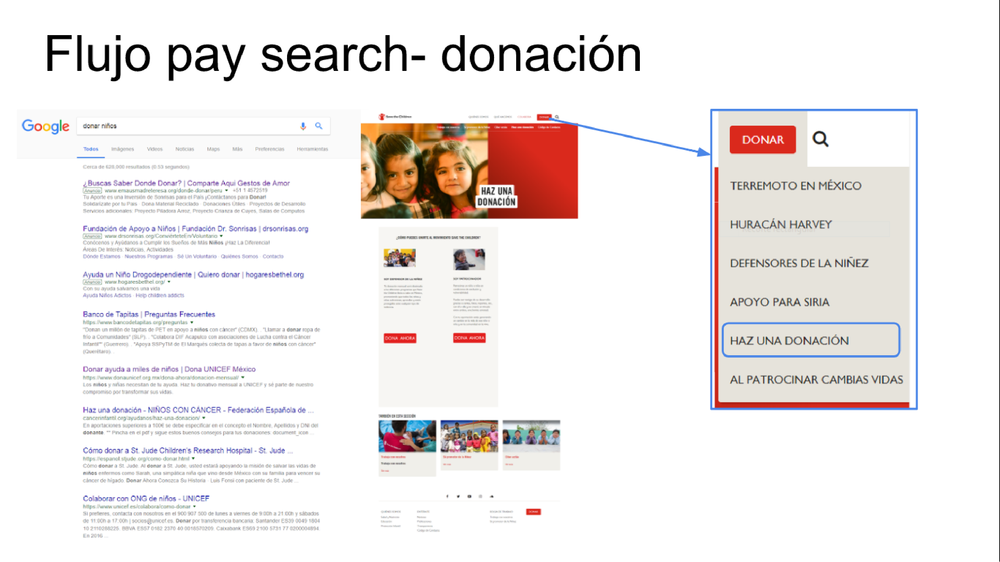
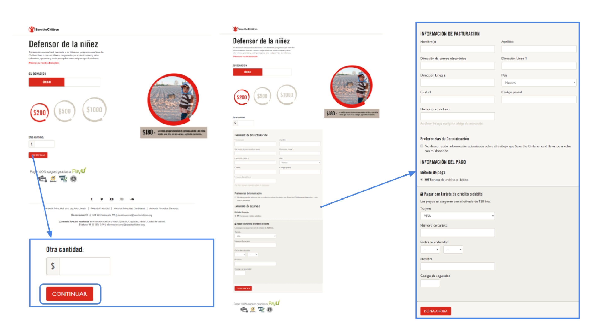
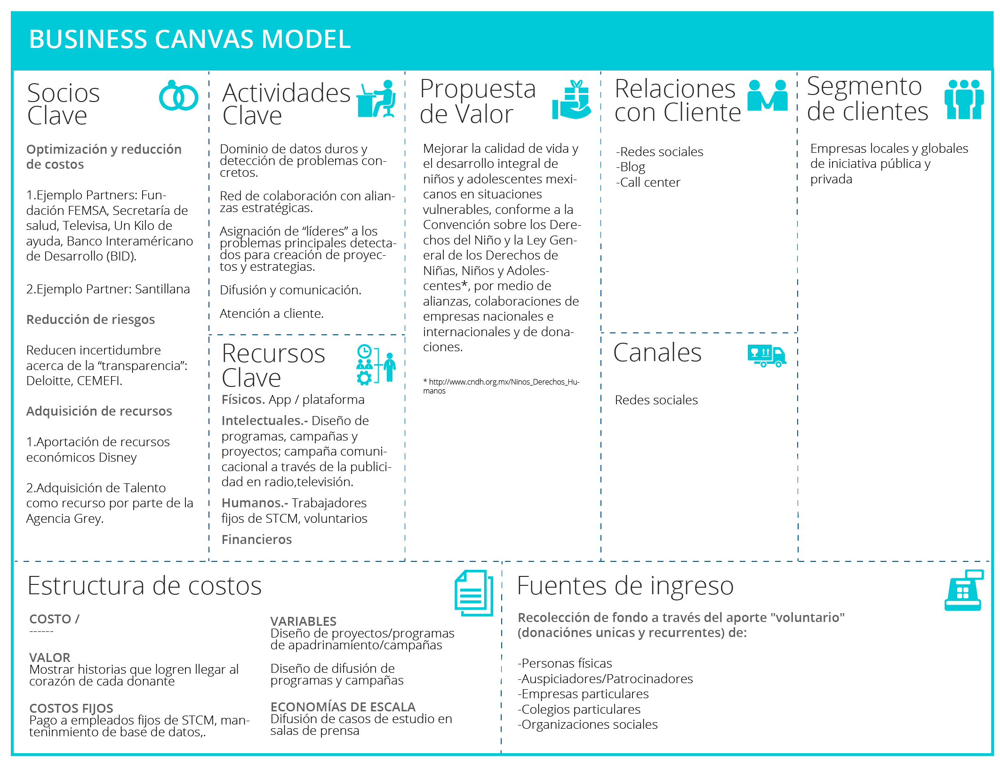
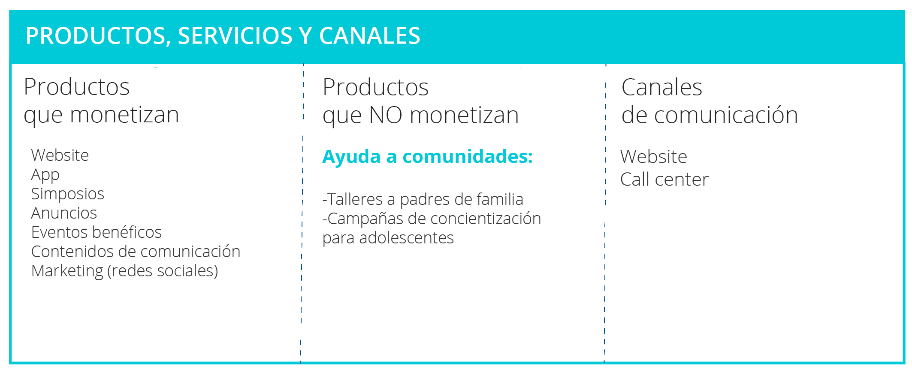
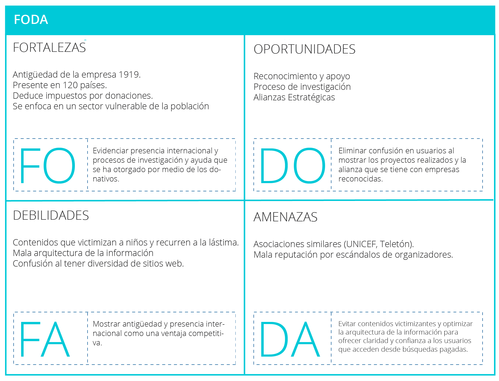

# Proyecto Sprint #2 | Track UX _Laboratoria_

## Reto

Optimizar la conversión de visitantes a donadores, mediante landing page apoya.savethechildren.mx

## Investigación

### Socios Clave

LINK DE INFO https://www.savethechildren.mx/sci-mx/files/18/1862e3c0-4cfa-459c-8f98-879b7c7f9786.pdf

**Optimización y reducción de costos**

1. Ejemplo Partners: Fundación FEMSA, Secretaría de salud, Televisa, Un Kilo de ayuda, Banco Interaméricano de Desarrollo (BID).

Organización y convocatoria al 1er Simposio de Desarrollo Infantil Temprano “Cimientos para el Futuro”, 2016.

“…con el BID y Save the Children México. Con la Secretaría de Salud y Fundación Televisa como co-convocantes y en colaboración con Un Kilo de Ayuda, abrimos un espacio de diálogo con invitados de honor como el Dr. José Narro Robles, Secretario de Salud de México y Carlos Salazar Lomelín, Director General de FEMSA. Más de 200 especialistas del
sector, provenientes de 9 países, analizaron la situación de la primera infancia, compartieron lecciones aprendidas, entendieron los desafíos que la región enfrenta y buscaron sinergias de colaboración en la materia.”

http://www.informesostenibilidad.femsa.com/fundacion-femsa.html

2. Ejemplo Partner: Santillana

Facilita la impresión de lentes guía de diagnóstico dentro de sus libros de texto
Con el objetivo de que alumnos de primaria detecten oportunamente si padecen visión borrosa por errores refractivos, Save The Children y Santillana se unen para distribuir Lentes Guía, distribuyendo un par de lentes por alumno para diagnóstico a través de la Guía de estudio Santillana, que actualmente llega a alumnos de todos los grados de primaria.

https://www.savethechildren.mx/que-hacemos/defensa-de-los-derechos-de-la-ninez/educacion/lentes-guia
http://grey.com/mexico/work/key/paper-glasses/id/12432/#theinsight

**Reducción de riesgos**

Reducen incertidumbre acerca de la “transparencia”: Deloitte, CEMEFI.

Cada año, la firma internacional Deloitte realiza auditorías fiscales y financieras a Save the Children México.
Cuenta con la acreditación de Institucionalidad y Transparencia, otorgada por el Centro Mexicano de Filantropía (Cemefi). Save the Children cumple con la totalidad de Indicadores de Institucionalidad y Transparencia, alcanzando el nivel Óptimo, por la claridad en sus acciones y en el uso de los recursos; así como el impacto y cambios positivos generados en las condiciones de vida de la población participante.

https://www.savethechildren.mx/enterate/transparencia

**Adquisición de recursos**

1. Aportación de recursos económicos Disney

Tras sismo del 19 de Septiembre en México dona 500 mil dólares a México para damnificados a Cruz Roja Mexicana, Save the Children y UNICEF.

http://www.excelsior.com.mx/funcion/2017/09/26/1190769

2. Adquisición de Talento como recurso por parte de la Agencia Grey.

Proyecto “Periodo de aprender”
Dados los alarmantes índices de embarazo adolescente, se genera esta iniciativa de profundizar en temas íntimos, que las adolescentes temen preguntar abiertamente por sentirse juzgadas, a través de mensajes breves informativos en las toallas femeninas para niñas de primaria de 5to y 6to grado.

Entrevista min 4:58 comenta participación de Grey colaborando en idear la solución
https://www.youtube.com/watch?v=yGCKtHdfi8s
Página con mayor información sobre el proyecto:
https://apoyo.savethechildren.mx/periodo-para-aprender

**Actividades clave**

- Dominio de datos duros locales y nacionales actualizados sobre los principales problemas de los niños y adolescentes.

- Detectar problemas concretos. Por ejemplo ¿Qué factores influyen en la deserción escolar?

- Red de colaboración con alianzas estratégicas que facilitan recursos económicos y de valor como canales de difusión, imagen pública, talento creativo para la resolución de problemas, diseño, voluntariado corporativo, entre otros.

- Asignación de “líderes” a los problemas principales detectados

- Creación de proyectos y estrategias para ayudar a las niñas, niños y adolescentes con el objetivo de asegurar que sobrevivan, aprendan y estén protegidos ante cualquier tipo de violencia

- Difusión de iniciativas para atraer donantes por medio de promotores de la niñez que interceptan a las personas en la calle de las ciudades, para animarlas a ser “patrocinador” o “defensor de la niñez”

- Estrategia de comunicación en redes sociales por medio de videos en las comunidades y la invitación a donar por medio de embajadores (influencers). También constantes entrevistas en radio y televisión en la sección de noticias.

- Atención a cliente, por medio de línea telefónica, correo electrónico y sitio web.

**Propuesta de Valor**

Mejorar la calidad de vida y el desarrollo integral de niños y adolescentes mexicanos en situaciones vulnerables, conforme a la Convención sobre los Derechos del Niño y la Ley General de los Derechos de Niñas, Niños y Adolescentes*, por medio de alianzas,  colaboraciones de empresas nacionales e internacionales y de donaciones.

* http://www.cndh.org.mx/Ninos_Derechos_Humanos

### Flujo actual

### Bussines Model Canvas

### Productos y canales

## Analisis FODA y Cruce de Estrategias

## Cuadro Objetivo de Negocio

## Encuesta

## Journey Testeo moderado

### Usuario 1: Mirna Tello

### Búsqueda

- Al seleccionar el input:
'Yo hubiera buscado "dónde puedo donar" / "niños de la calle /sin hogar"...'

### Landing

- Inmediatamente comienza a llenar el formulario sin leer la información, pero antes de enviarlo, presta atención al texto. Transcurren 5 min y selecciona opción "Nuestro trabajo"

- Comienza a leer primer párrafo y baja dando scroll hasta la foto de la fundadora "¿Ella fundó la organización?", la no obtener respuesta decide no buscar de quién se trata, no muestra interés en leer la historia.

- Presiona el video: El vídeo en Youtube NO TIENE AUDIO, alrededor de la mitad, lo cierra y regresa a la página, pero menciona haber entendido que con $4 al día puede ayudar a un niño.

- Regresa al inicio y ahora selecciona "Cómo utilizamos el dinero", no lo lee. Regresa a la parte superior, vuelve a recorrer la página con scroll rápido.

- En este punto no comprende qué debe hacer, entonces se le pregunta si ha enviado los datos del formulario y recuerda que no. Después de la indicación envía sus datos con el botón "registrarse" y menciona "creo que ya terminé porque ya estoy inscrita"

- Al ver el segundo formulario "Me gustaría que recordara los datos que ya le di" "No entiendo si son $300 al día o cada cuánto"

- Busca un teléfono dónde comunicarse, no lo encuentra. Abandona la página

### Donación

- No se realiza

### Usuario 2: Teresita de Jesús Tello

### Búsqueda

Va directo a Save the Children, estaba predispuesta por el título del formulario.

### Landing

- Lee primera vista en alrededor de 3 minutos. Muestra cara de confusión y a ratos de asombro sobre los datos.
- Da click a los 3 enlaces de "conoce más", lee detenidamente encabezado y primeras líneas pero no revisa toda la información, sólo la recorre rápidamente.
- Ve el video, no menciona nada sobre el volumen y lo observa completo. Al terminar pregunta qué debe hacer, se le indica volver a la página.
- Llena formulario.
- Menciona que ella quisiera donar una cantidad diferente "El video menciona que con $4 al día ayudas a un niño y eso son $120, entonces yo quisiera donar $600 que son 5 niños"

### Donación

- Se realiza y al aparecer la pantalla de agradecimiento, da scroll y menciona:

"No me siento segura de que se haya hecho mi donativo. No es lo que esperaba después de donar"
"A mi me gustaría saber de qué manera mejora su vida y a qué niños les estoy donando"

- Busca dónde encontrar información "No resuelven ninguna duda / voy a tener que pedir ayuda a alguien para buscar esa información y comunicarme"

- Sale de la página

### Usuario 3: Victoria Colunga

### Búsqueda

"Probablemente hubiera buscado con 'fundaciones niños pobreza'..."
- Lee opciones presentadas por Google antes de seleccionar una y pregunta "¿Es Save the Children, verdad?"

### Landing

- Observa primera vista alrededor de 5 segundos y comienza a dar scroll hacia abajo pausadamente pero sin terminar de leer ninguno.

- Se detiene brevemente en la línea del tiempo pero no concluye la lectura, menciona "No alcanzo a ver bien, se ve interesante" continua dando scroll.

- No ve el video

- Llega a ultima parte y presiona el botón "Regístrate y apoya nuestra labor".

- Llena formulario

- Llena segundo formulario y comenta "Osea que no puedes donar sólo una vez y poner la cantidad que quieras?" "No me da confianza darles mis datos de tarjeta sin más información"

### Donación

- Concluye la donación pero no luce contenta...

"Lo hice porque era una simulación y quería ver qué pasaba después pero realmente no lo hubiera hecho de otra forma porque no te dicen exactamente cómo funciona ni te dejan escoger"

"Hubiera buscado la manera de llamar o hubiera buscado otro lugar dónde donar que sí me diera la seguridad necesaria y la posibilidad de escoger las condiciones de mi donativo"

### Insights

## Sketches

